<div align="center">

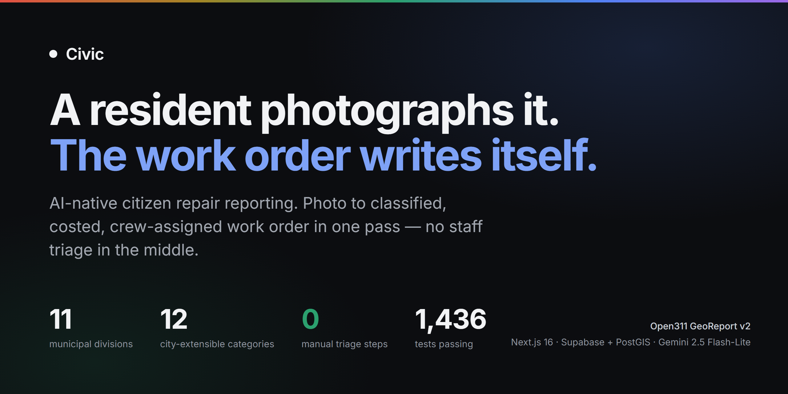

### The gap between a resident noticing a pothole and a crew being dispatched to it

[](https://nextjs.org)
[](https://www.typescriptlang.org)
[](https://supabase.com)
[](https://ai.google.dev)
[](#4-proof-it-works)
[](#open311-is-the-product-not-an-integration)
[](https://github.com/ssamba1/civic/actions/workflows/test.yml)
[](https://github.com/ssamba1/civic/actions/workflows/migrations.yml)
[](LICENSE)

**HackSocial · AI/ML track** — submission write-up in [`SUBMISSION.md`](SUBMISSION.md)

</div>

---

## What it is

A resident photographs something broken. A pothole, a dead streetlight, a downed sign, a sidewalk that has heaved, a drain that no longer drains.

Civic reads the photograph, grades the severity, checks it against nearby reports so the twentieth call about the same pothole does not become the twentieth work order, prices the repair, and assigns it to the division and crew that does that work.

Nobody reads a form in the middle. **The work order is the report, transformed.**

The pilot city is Cumming, Georgia.

The same pipeline runs on video. A phone mounted on a truck that already
drives every street produces far denser data than residents ever will — and a
ruinous model bill, if every frame goes to a vision model. So the model is the
*last* step: a local detector scans the frames for free, Postgres clusters the
detections, and only a cluster that survives a confidence threshold costs a
model call. On the seeded clip, **375 frames became 531 detections, 33
clusters, and 27 reports** — with the model asked about a fraction of those 33.
See [the video vertical](#the-video-vertical-how-to-use-a-model-without-a-model-bill).

We built it because the backlog everyone blames on budget or on crews is
usually a backlog of *unstaffed triage* — and reading a photograph into a
category is the one thing a vision model is unambiguously good at. The
interesting question was never whether AI could do that step. It was how much
of the process you dare let it touch, when the output is public money and a
truck. The answer this repository argues for: **the model classifies, and it
never dispatches.**

<picture>
  <source media="(prefers-color-scheme: dark)" srcset="docs/images/landing-dark.jpg">
  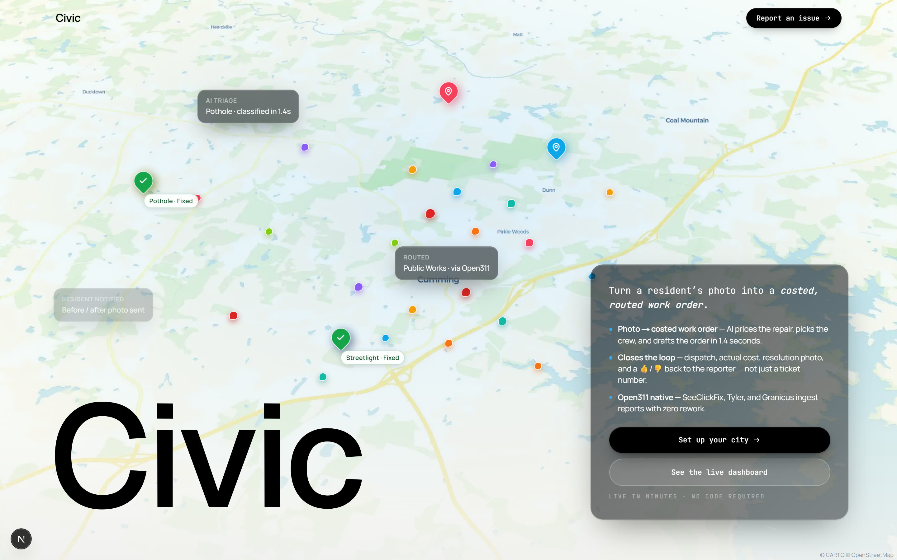
</picture>

<div align="center"><sub>The public landing page. The map is live, the pins are real reports, and the two callouts are the actual pipeline stages.</sub></div>


<div align="center"><sub>Recorded from the running app against the seeded city. Every count on every node is read from the database, not drawn.</sub></div>

### The one screen that explains the whole product

<picture>
  <source media="(prefers-color-scheme: dark)" srcset="docs/images/dashboard-dark.png">
  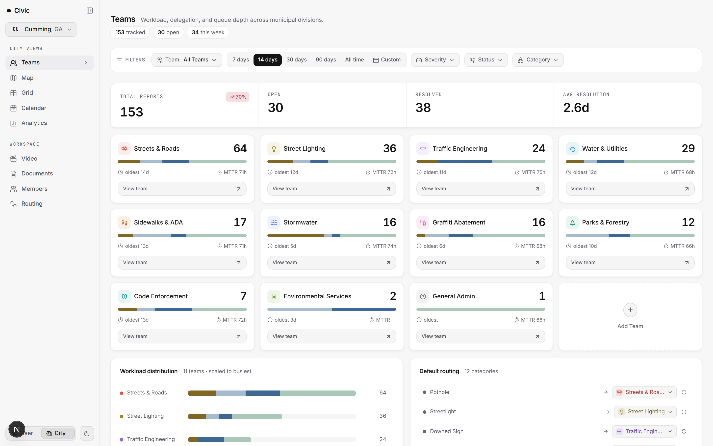
</picture>

That is a live screenshot against the seeded pilot city. Eleven divisions, each with its **queue depth, its oldest untouched item, and its mean time to repair**. Streets & Roads is carrying 64. General Admin is carrying 1.

The thing worth noticing is what is *not* on this screen: an inbox. There is no queue of unread reports waiting for a person to categorise them. By the time a report appears here it already has a category, a severity, a cost, a division and a crew. A public-works director opens this page to *manage* work, not to *create* it.

---

## How to read this

Pick the path that matches the time you have. Every deep section is collapsed, so the page is shorter to read than its length suggests.

| You have | Read this | What you get |
|---|---|---|
| **3 minutes** | The screenshot above, then [What makes it different](#2-what-makes-it-different) | The whole argument |
| **10 minutes** | Add [The problem](#1-the-problem) and [How it works](#3-how-it-works) | Why it exists and how it is built |
| **You are reviewing the code** | [Proof it works](#4-proof-it-works), especially the bug-class writeup | What we actually learned |
| **You are running it** | [Run it locally](#run-it-locally) | Up in five minutes |
| **You want the honest version** | [Honest limits](#6-honest-limits) and [FAQ](#7-faq) | Everything we would rather you heard from us |

<details>
<summary><b>Full contents</b></summary>

<br>

1. [The problem](#1-the-problem): the 311 backlog, who it serves, what it is worth
2. [What makes it different](#2-what-makes-it-different): five ideas, and what we refused to build
3. [How it works](#3-how-it-works): the pipeline, the dispatcher, a worked example, [the video vertical](#the-video-vertical-how-to-use-a-model-without-a-model-bill), data model, stack, security
4. [Proof it works](#4-proof-it-works): every check, the live Open311 export, CI, and a real bug class
5. [The two products](#5-the-two-products): what a resident sees, what a director sees
6. [Honest limits](#6-honest-limits): what we are not claiming
7. [FAQ](#7-faq): the questions we expect
8. [Run it locally](#run-it-locally) · [Repository layout](#repository-layout) · [The team](#the-team) · [License](#license)

</details>

### Other files worth knowing about

| What | Where |
|---|---|
| Inspiration, tech stack, and what we learned | [`SUBMISSION.md`](SUBMISSION.md) |
| The rules every contributor follows, human or model | [`agents.md`](agents.md) |
| Architecture decisions that closed off alternatives | [`docs/decisions/`](docs/decisions/) |
| On-call procedures: AI pipeline, Open311 conformance, cutover, key rotation | [`docs/runbooks/`](docs/runbooks/) |
| Plans and in-flight work | [`docs/planning/`](docs/planning/) |
| Live demo | Not deployed. See [Honest limits](#6-honest-limits) |

---

## 1. The problem

### The place

**Cumming, Georgia.** A small city in Forsyth County with a public works department measured in dozens of people, not hundreds, responsible for the roads, drains, signs, lights and sidewalks of a place that keeps growing.

It is not an unusual place. It is the ordinary case: **most American cities are small cities**, and most of them run 311 on a phone number, an email inbox, a spreadsheet, or a vendor system priced for a metro.

### Why the existing 311 stack fails a city this size

A 311 report today arrives as free text. "There's a big hole on Dahlonega near the church." Someone has to read it, work out that it is a pothole, guess how bad it is, decide it belongs to Streets & Roads, check whether the same hole was reported on Tuesday, and open a work order.

That someone is the bottleneck, and in a small city that someone is often also doing three other jobs.

The result is the failure mode every resident recognises: you report a thing, hear nothing, and conclude the city does not care. It usually does. It is just that the report is sitting in a queue behind two hundred others, and nobody has had an hour to sort them.

**Civic's bet is that the sorting is the part a model is genuinely good at, and the dispatching is the part it must not touch.**

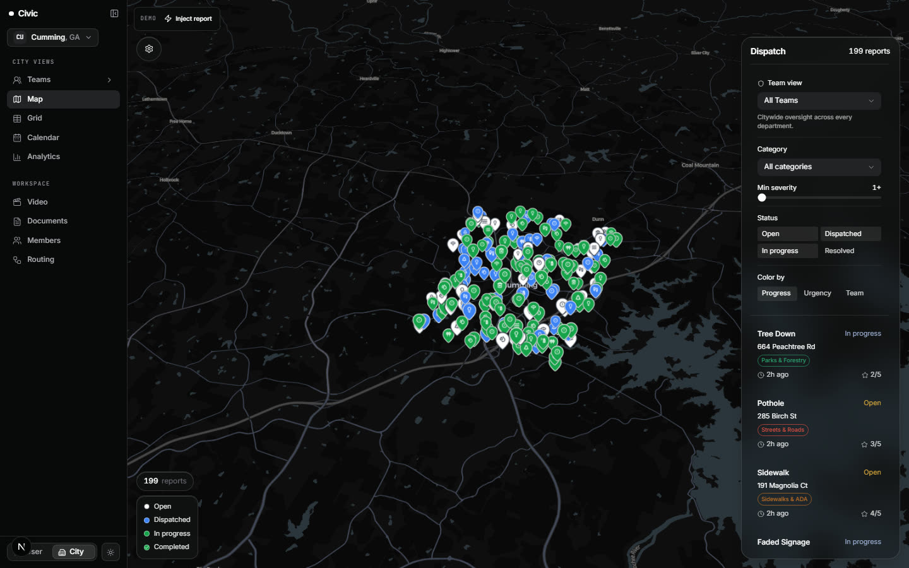

<div align="center"><sub>199 reports on the real street network, filterable by division, category, severity and status, dispatchable from the panel.</sub></div>

### Who it is for

| Audience | What they get |
|---|---|
| A resident with a phone and thirty seconds | Photograph, submit, done. A status link that keeps working, with no account required |
| A public works director | A queue that is already sorted, priced and assigned, and an honest picture of what is overdue |
| A crew in a truck | A field view of their own jobs, on their own phone |
| A county or state agency | The whole record in **Open311 GeoReport v2**, a format they already consume |
| A resident who wants accountability | A public map and dashboard nobody has to be asked to produce |

### What it is worth

The cheap version of this argument is "AI saves staff time". The real one is narrower.

A small city's repair backlog is not usually limited by crews. It is limited by **the triage step in front of the crews**, which is unstaffed. Remove that step and the same crews get to the same work sooner, and the city gets a defensible public record of what was reported and what was done about it — the thing that turns a complaint into evidence at a budget meeting.

It is cheap to run: one Postgres database, one web deployment, and a vision model call measured in fractions of a cent per report.

---

## 2. What makes it different

The quickest way to see it is next to the thing it replaces.

| | A standard 311 system | Civic |
|---|---|---|
| **What arrives** | Free text a person must read | A photo a model has already read |
| **Who categorises** | A staff member, eventually | The classifier, at submission time |
| **Duplicate handling** | Noticed by memory, or not at all | PostGIS radius + recency check before a work order exists |
| **What a report becomes** | A ticket | A costed work order with a division, a crew and an SLA clock |
| **Who defines the categories** | The vendor, in code | The city, as rows |
| **What the record is for** | Closing tickets | A public map, and an Open311 export an agency can ingest |
| **Where the AI stops** | Wherever the demo ended | At the classification. Every allocation after it is deterministic |

Five ideas produce those differences.

### 1. The classifier writes the work order, not a suggestion

The output of classification is not a label for a human to confirm. It is a **complete work order**: department, crew type, priority score, estimated minutes, materials list and a deterministic cost floor.

Priority is arithmetic, not vibes — `severity × 2 + recurrence + emergency × 50` — so two reports with the same inputs always rank the same way, and a director can be told exactly why one outranked another.

### 2. The model classifies. It never dispatches.

This is the line the whole design is built around.

Gemini decides *what the photograph shows*. Everything after that — which division owns the category, which crew is picked, what the repair costs, when the SLA expires — is a deterministic function of that answer, written in code you can read, with tests.

A misclassification therefore delays a job. It cannot invent a repair, misprice one, or silently drop one. That containment is what makes it defensible to run a model in a workflow that spends public money.

### 3. Deduplication happens before a work order exists, in the database

The twentieth report of the same pothole should not be a new job. `ST_DWithin` against a **GiST index** on `geography(POINT, 4326)` finds open reports within 50 m from the last 30 days, and the duplicate merges into the original — bumping its recurrence count, which raises its priority.

Twenty neighbours reporting the same hole is not twenty tickets. It is one job that just became more urgent, which is the correct reading of what happened.

Two things are deliberately true of it. **It ships behind a flag** (`DEDUP_REPORTS=1`, off by default) because auto-merging a resident's report is the kind of thing a city should switch on knowingly rather than discover. And **an emergency is never deduped** — the one case where a false merge is unacceptable is the one where the hazard is active.

Spherical distance in the database, never haversine in application code.

### 4. Categories and divisions are data, not code

Twelve categories ship built in. A city adds its own as rows through the onboarding wizard, and the classifier is offered `BUILTIN ∪ that city's issue_types` on every request.

The Open311 catalogue follows the same rule: a city's own service codes are published under their own names rather than being flattened into the nearest builtin, because telling an agency `drainage` when the city said `custom_creek_bank_erosion` throws away the only part that was specific.

### 5. Cost is computed, not estimated by the model

`estimateCost` is a labour rate times the rule's minutes plus a flat material cost. It is boring on purpose.

The moment a language model produces the dollar figure on a municipal work order, that figure has to be defended in a public meeting by someone who cannot explain how it was reached. A rules table can be printed and argued with.

<details>
<summary><b>Where this goes next</b></summary>

<br>

- **Resolution verification.** `work_orders.resolution_photo_url` and `resolution_ai_score` already exist: the crew photographs the finished repair and the same vision path grades whether it matches the original complaint.
- **Contractor marketplace.** Contractor crews already sit alongside municipal ones in dispatch — the seeded city routes potholes to `Northside Paving LLC`. Bidding on the backlog is the natural extension.
- **More than one city.** Nothing in the schema is Cumming-specific. The city is a row, and five already exist in the reference database.

</details>

---

## 3. How it works

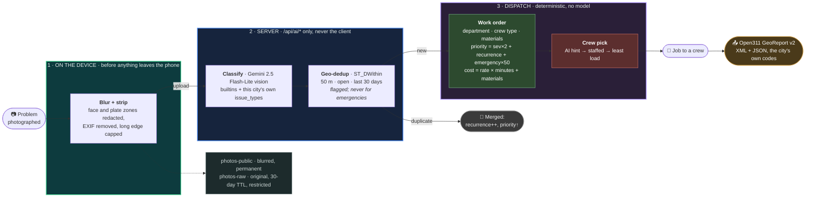

Every stage is best-effort and idempotent. A failure logs and returns null instead of throwing, and the final assignment is guarded so a re-run never overwrites a decision a human made. A partly-classified report that reached a person is worth more than a lost one.

### The pipeline, as the product draws it

<picture>
  <source media="(prefers-color-scheme: dark)" srcset="docs/images/routing-dark.png">
  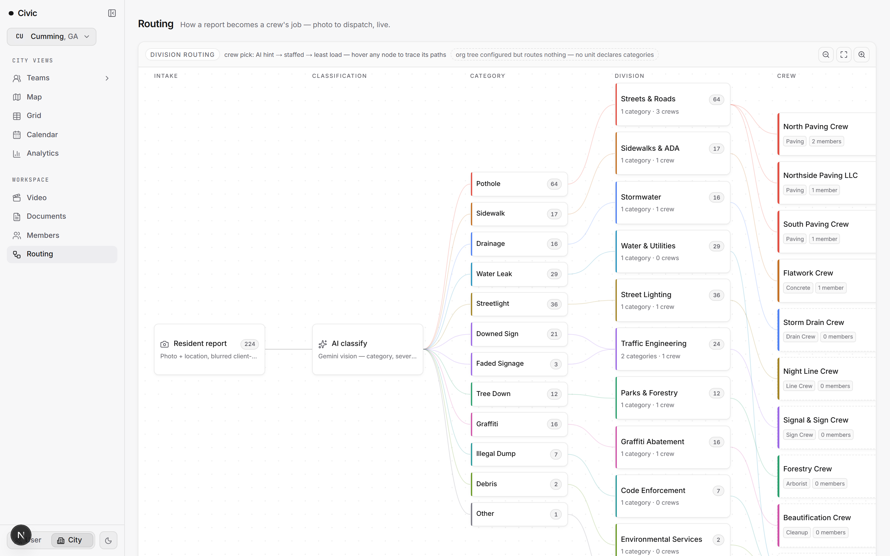
</picture>

<div align="center"><sub>The real pipeline with live counts on every node — 224 resident reports fanning out through twelve categories into eleven divisions and their crews.</sub></div>

This page is not a diagram of the architecture. It is a **rendering of the current configuration**, drawn from the same tables dispatch reads. If a category is routed somewhere surprising, this is where you see it, and the chip at the top says plainly when a configured org tree is routing nothing because no unit has claimed any categories.

A configuration screen that cannot show you its own consequences is how routing silently rots.

### The dispatcher, in full

The model may hand dispatch a `crew_hint` — a name it read out of the crews' own descriptions. If that hint matches a real crew exactly, it is honoured. If it names a crew that does not exist, the miss is **logged** and the hint is discarded rather than guessed at.

Everything else is `pickCrew` in [`src/lib/ai/crew-assign.ts`](src/lib/ai/crew-assign.ts): a pure comparator over five criteria in fixed order, with no model call in it.

```ts
const sorted = [...candidates].sort((a, b) => {
  const aStaffed = a.memberCount > 0;
  const bStaffed = b.memberCount > 0;
  if (aStaffed !== bStaffed) return aStaffed ? -1 : 1;   // 1. people before shells

  const loadA = loadPerCapita(a);                         // openMinutes / members
  const loadB = loadPerCapita(b);
  if (loadA !== loadB) return loadA - loadB;              // 2. fairness, per person

  if (a.openWorkOrders !== b.openWorkOrders)
    return a.openWorkOrders - b.openWorkOrders;           // 3. queue depth

  const lastA = a.lastAssignedAt ?? Number.NEGATIVE_INFINITY;
  const lastB = b.lastAssignedAt ?? Number.NEGATIVE_INFINITY;
  if (lastA !== lastB) return lastA - lastB;              // 4. round-robin
  return a.name.localeCompare(b.name);                    // 5. stable tiebreak
});
```

Load is **per capita** — open minutes divided by crew size — so a six-person crew absorbs proportionally more than a two-person crew before it looks loaded. Ranking by raw queue depth would quietly punish small crews for being small.

An unstaffed crew is still assignable, deliberately. A city creates a division before it hires into it, and work needs somewhere to land in the meantime; it just loses to any crew that has people.

The last tie-break is the crew's name, which exists so that **re-running the pipeline picks the same crew**. A dispatcher that shuffles on every retry is one no operator can reconcile against yesterday's list.

### Eight real reports, eight real dispatches

Pulled from the running database. Each row is an actual chain of report → classification → work order → crew.

| Filed | Where | Sev | Conf | Department | Crew | Est. |
|---|---|:--:|:--:|---|---|--:|
| Pothole | 359 Dahlonega Hwy | 3 | 0.60 | Public Works | **Northside Paving LLC** *(contractor)* | 90 min |
| Downed sign | 788 Aspen Ave | 5 | 0.90 | Public Works | **Signal & Sign Crew** | 130 min |
| Drainage | 887 Poplar Ln | 5 | 0.90 | Public Works | **Storm Drain Crew** | 130 min |
| Sidewalk damage | 819 Birch St | 5 | 0.90 | Public Works | **Flatwork Crew** | 130 min |
| Streetlight | 566 Spruce Dr | 4 | 0.90 | Utilities | **Night Line Crew** | 110 min |
| Graffiti | 586 Oak Dr | 4 | 0.90 | Code Enforcement | **Beautification Crew** | 110 min |
| Faded signage | 149 Redwood Dr | 3 | 0.90 | Public Works | **Signal & Sign Crew** | 90 min |
| Tree down | 729 Juniper Rd | 3 | 0.90 | Parks | **Forestry Crew** | 90 min |

Eight categories reach **seven crews across five departments**, and one of them is a private contractor sitting in the same dispatch path as the municipal crews — because a small city's paving is often not done by the city.

Note the pothole's confidence: **0.60**. It still routed. Confidence is shown to staff, never used as a gate, because a report the model was unsure about is exactly the one that most needs a human to see it — and dropping it would be the one failure a resident would never forgive.

### The video vertical: how to use a model without a model bill

A city can mount a phone on a truck that already drives every street each week. That is a far denser source of pavement condition than resident reports — and a far more expensive one, if every frame goes to a vision model.

<picture>
  <source media="(prefers-color-scheme: dark)" srcset="docs/images/video-dark.jpg">
  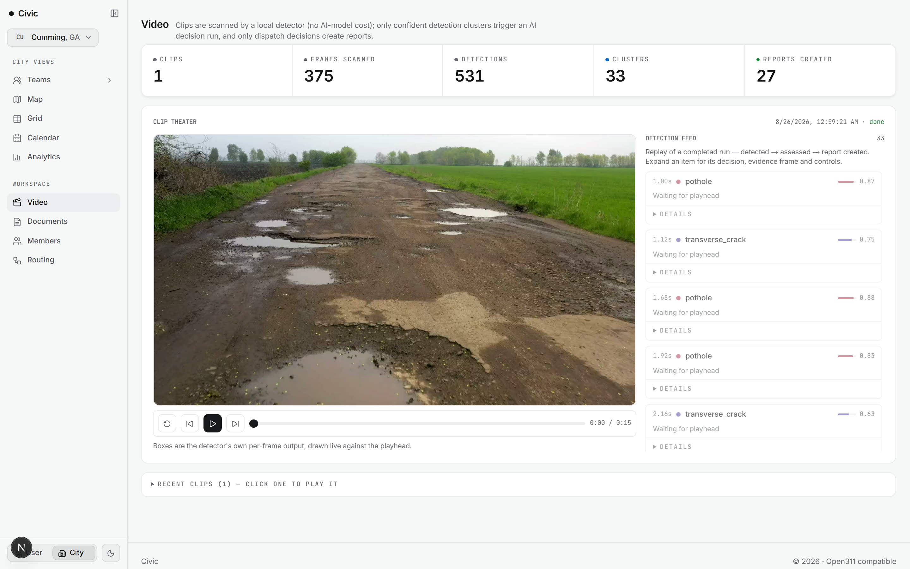
</picture>

So the model is the last step, not the first:

| Stage | Where it runs | On the seeded clip |
|---|---|--:|
| Frames scanned | Local detector, no model cost | **375** |
| Raw detections | Local detector | **531** |
| Spatial clusters | Postgres, GiST index on the centroid | **33** |
| AI decision runs | Gemini, only on confident clusters | *a fraction of 33* |
| Reports created | Only where the decision says dispatch | **27** |

531 detections become 33 clusters because the same pothole appears in dozens of consecutive frames and the clustering knows it is one defect. Only clusters that survive a confidence threshold cost a model call, and only a decision to dispatch creates a report.

The detector's own per-frame boxes are drawn live against the playhead, so a skeptical public-works director can watch what the machine claims to have seen, frame by frame, before believing the number at the top.

<details>
<summary><b>The data model</b></summary>

<br>

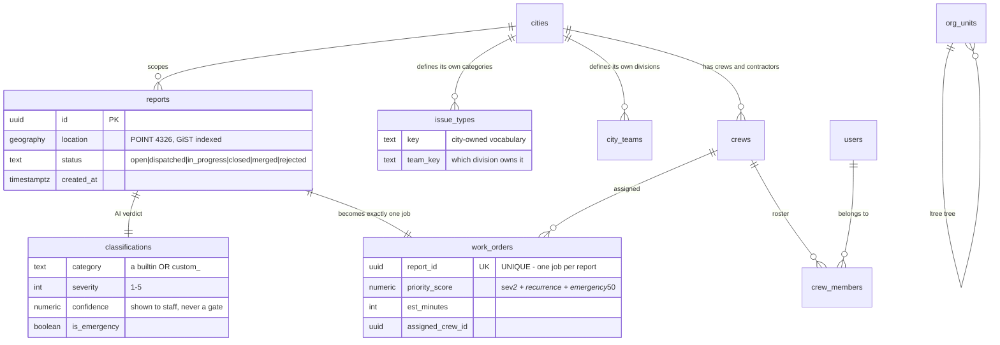

Two details carry most of the weight.

`issue_types` and `city_teams` hang off `cities`, which is why a city can extend its own vocabulary and its own org chart without a deploy.

`work_orders.report_id` is **UNIQUE** — one report becomes exactly one job, which is what makes the dedup step load-bearing rather than cosmetic. That same unique constraint is also what caused the nastiest bug in [Proof it works](#4-proof-it-works), because it decides the *shape* PostgREST returns.

</details>

<details>
<summary><b>Stack, and why each piece</b></summary>

<br>

| Layer | Choice | Why this one |
|---|---|---|
| Framework | **Next.js 16**, App Router, server components by default | Server components keep the model API key server-side by construction. `"use client"` is the exception |
| Database | **Supabase Postgres + PostGIS** | `geography(POINT,4326)` with `ST_DWithin` gives real spherical distance. No haversine in application code |
| Auth and storage | Supabase Auth, two buckets | `photos-public` for blurred images, `photos-raw` for originals on a 30-day timer with restricted access |
| AI | **Vercel AI SDK + Gemini 2.5 Flash-Lite** | Vision and structured classification in one call. Flash-Lite returns a correct structured classification in ~3-4s against ~6-30s for full Flash, and submission latency is what a resident actually feels. The help assistant uses full Flash, where multi-turn tool-calling is worth the wait |
| Maps | **MapLibre GL + deck.gl** | Open source, no Mapbox token, no per-view billing for a city with no budget line for one |
| Tables | **AG Grid** | A public-works director lives in a table. Filtering, grouping and inline edits on 158 rows without a bespoke grid |
| Validation | **Zod** at every boundary | Server actions return `{ ok: true, data }` or `{ ok: false, error }`. Errors are values, not exceptions |
| Lint and format | **Biome** | One tool, fast enough to run on every save |
| Tests | **Vitest**, **Playwright**, SQL suites | Covered in [Proof it works](#4-proof-it-works) |

</details>

<details>
<summary><b>Security and privacy</b></summary>

<br>

| Rule | How it is enforced |
|---|---|
| Never call the model from the client | All model calls go through `/api/ai/*` server routes. The key is not in any `NEXT_PUBLIC_*` var |
| No raw photo reaches the public bucket | Blur runs on the device before upload. The original goes to a separate restricted bucket on a 30-day timer. Checked by `pnpm audit:privacy`, which passes across all 5 cities in the reference database |
| Row-level security on every table, deny by default | 77 ordered migrations, with a dedicated regression suite in [`tests/rls/`](tests/rls/) |
| No personal data in URLs | Public status pages use an opaque salted token (`/r/[token]`), never a report id — report ids are public through the Open311 API, so a naive status URL would let anyone enumerate every resident's report |
| The rate limiter cannot be spoofed | It keys off the platform-set client-IP header only. Server env validation **throws** in production without it, rather than silently falling back to a forgeable `x-forwarded-for` |

The blur is honest about its own limits, in a docblock at the top of [`src/lib/privacy/blur.ts`](src/lib/privacy/blur.ts): see [Honest limits](#6-honest-limits).

</details>

---

## 4. Proof it works

Every number here was produced by running the command in the middle column on the commit you are reading.

| Check | Command | Result |
|---|---|---|
| Types | `pnpm typecheck` | **clean**, TypeScript strict |
| Unit tests | `pnpm test` | **1,419 passing** across 136 files |
| Lint | `pnpm lint` | **0 errors** |
| Production build | `pnpm build` | **96 routes compile**, 42 prerendered |
| Row-level security | `pnpm test:rls` | **45 passing** across 11 suites |
| End to end | `pnpm test:e2e` | 7 Playwright specs |
| Privacy audit | `pnpm audit:privacy` | **No raw-photo leaks across 5 cities** |
| Live health | `pnpm health` | `{"status":"ok","checks":{"database":true,"ai":true}}` |
| Accessibility | Lighthouse | **100 / 100 / 100** — a11y, best practices, SEO — on `/` and `/report`, mobile |
| Core loop, end to end | a real photo through `/report` | Filed on a phone viewport → classified **pothole at 0.95** → work order at public works / paving / 30 min / $98 |

The seeded pilot city holds **158 reports, 108 work orders, 9 crews and 66 users**, across 11 divisions and 12 categories.

Accessibility, best practices and SEO are structural and hold in any build, so
those numbers are quoted. **Performance is not quoted**: the only Lighthouse run
here was against a dev server, where the number measures the dev bundler rather
than the product, and a figure like that is worth nothing to a reader.

### Open311 is the product, not an integration

Checked live against the running app rather than asserted:

```console
$ curl -s '/api/open311/v2/requests.json?jurisdiction_id=cumming.ga.gov' | jq length
153

$ curl -s -H 'Accept: text/xml' '/api/open311/v2/requests?jurisdiction_id=cumming.ga.gov' \
    | grep -c '<request>'
153
```

**153 service requests, in both JSON and XML, across 12 distinct service codes and 6 responsible agencies**, with `expected_datetime` computed from the per-category SLA on the 115 that are still open. The service catalogue, pagination, status filtering and error envelopes are all GeoReport v2 shaped.

This matters more than it looks. An export that works is the difference between a city owning its own record and renting it from a vendor.

### Continuous integration

Two workflows gate every push and pull request.

**`test.yml`** runs type-check, lint, unit and RLS tests, and a production build, then Playwright and the privacy audit. It stays green on a fork with no secrets, because the database suites skip instead of failing — a CI file that only works for people holding credentials is not a gate.

**`migrations.yml`** applies all **77 migrations in order to an empty Postgres with PostGIS**, which is what standing up a new city actually does. Applying migrations one at a time to a live database hides a whole class of defect, and this repository has been bitten by it before.

<details>
<summary><b>A real bug class that every green check missed, and what it had in common</b> (worth opening)</summary>

<br>

Every check in the table above was green while all of the following were live. Each was found by running the product against real data, and each now has a regression test.

**The pattern.** The product ships twelve built-in categories and lets a city define more on top. Several lookup tables were written as `Record<ReportCategory, …>` back when twelve was the whole world. Each was exhaustive when written and stopped being authoritative the day the classifier was extended to offer `BUILTIN ∪ issue_types`. TypeScript could not help, because the key arrives at runtime from a database row.

| Symptom | Root cause | Why nothing caught it |
|---|---|---|
| **A report was saved, then never dispatched.** No work order, no crew. The resident saw a thank-you screen and nobody saw an error | `generateWorkOrder` did `RULES[classification.category].department` with no guard. For a city-defined category the lookup was `undefined`, and dereferencing it threw *after* the classification had already been persisted, so the catch above reported "classification service unavailable" for a report that was sitting safely in the table | The worst one. The seeded work orders exist because the seed script writes them directly instead of going through the pipeline, so the demo looked healthy while the live path was broken |
| The Open311 export returned `200 OK` and an empty list while the reports table was full | PostgREST returns an embedded relation as an array for to-many and a bare object for to-one, and the shape flips when a migration adds a unique constraint — which `work_orders.report_id UNIQUE` is. The row schema accepted arrays only, so every row failed validation and was silently dropped | Types were fine. The shape is decided at runtime by the database |
| Fixing the above revealed a `500` on every city-defined category | An SLA lookup returned `undefined`, arithmetic on it produced `NaN`, and `new Date(NaN).toISOString()` throws | Hidden the whole time behind the bug that discarded the rows first |
| A resolution email that rendered the literal word `undefined` to a resident, and an empty "what was done" note on the status timeline | The same exhaustive-over-builtins table, indexed by a city key | Visible, but to residents rather than to us |

Three more of the same shape were fatal only in the sense that they were wrong rather than loud: a mistyped city slug answered **500 instead of 404** (a `generateStaticParams()` under a layout that reads the auth cookie, which also served partial renders for slugs that *do* exist), the routing page **500'd on any deployment with an incomplete server environment** because the Supabase client was constructed outside its own error guard, and `pnpm start:prod` **could not start at all** because Next inferred the workspace root from a stray lockfile in a parent directory and wrote the standalone entry point one directory away from where every script looked for it.

**What we take from it.** Every one of these failed **silently**: a 200 with no data, a saved report with no job, an email with a hole in it, a build that warned rather than failed. None of them threw where anyone was looking.

A passing build and 1,419 passing tests tell you the code agrees with itself. They do not tell you the product works. A browser hitting a page and a person reading a screenshot each caught in one look what every automated check missed.

The fix was not twenty patches, it was three accessors — `ruleFor()`, `categoryMeta()`, `categorySlaHours()` — each falling back to `other` for a key its table has never seen, and 22 call sites moved onto them. Call sites that iterate `CATEGORIES` rather than indexing by a runtime key were deliberately left alone: they cannot miss.

</details>

---

## 5. The two products

A resident on a sidewalk and a director at a desk are not the same user, so they get different products.

<table>
<tr>
<td width="50%" valign="top"><picture><source media="(prefers-color-scheme: dark)" srcset="docs/images/report-dark.png"></picture></td>
<td width="50%" valign="top"><picture><source media="(prefers-color-scheme: dark)" srcset="docs/images/status-dark.png">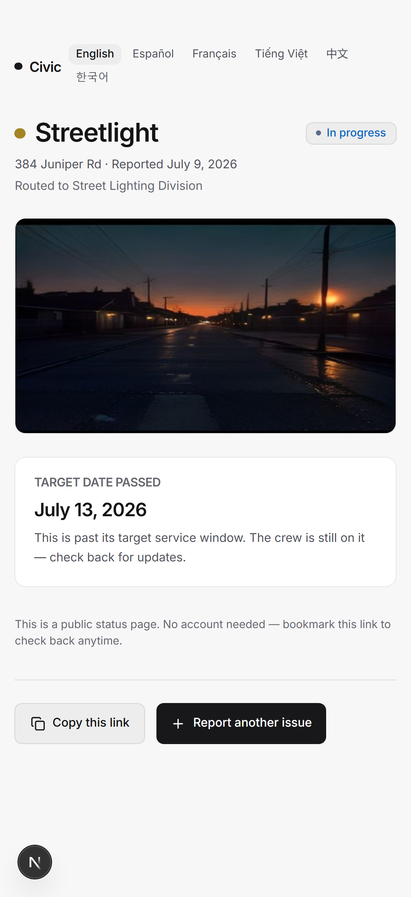</picture></td>
</tr>
<tr>
<td valign="top"><b>Camera first.</b> No form to read before you can photograph a problem. Two targets, both sized for a thumb, and the primary one is the camera.<br><br>The written empty state — "Take a photo of the problem to get started" — is the entire tutorial. A resident standing in front of a broken thing will not read anything longer.<br><br><b>Camera denied falls back to upload.</b> Geolocation, unreliable on some Android builds, falls back to tapping the map.</td>
<td valign="top"><b>The status page needs no account</b>, because requiring one is how a city loses the reporter. An opaque salted token, bookmarkable, never a report id.<br><br>It is <b>translated into six languages</b> — English, Spanish, French, Vietnamese, Chinese, Korean — batched per request. A 311 system that only answers in English does not serve the residents most likely to be ignored by one.<br><br>And it tells the truth: <b>"Target date passed"</b> when the SLA has blown, rather than showing a soothing "in progress" forever.</td>
</tr>
</table>

For staff, legibility over density. The same data answers two different questions, so it gets two different surfaces:

<picture>
  <source media="(prefers-color-scheme: dark)" srcset="docs/images/analytics-dark.png">
  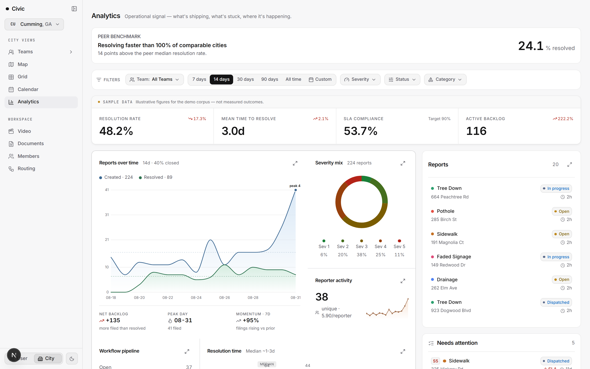
</picture>

<div align="center"><sub>Analytics answers "how are we doing" — and labels its own demo figures as sample data rather than passing them off as measured outcomes.</sub></div>

<details>
<summary><b>And the grid, which is where a public works director actually lives</b></summary>

<br>

<picture>
  <source media="(prefers-color-scheme: dark)" srcset="docs/images/grid-dark.png">
  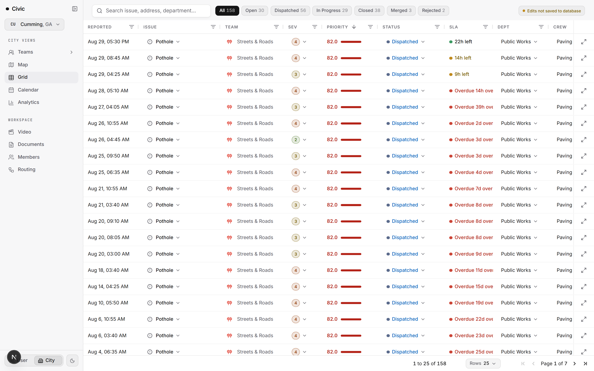
</picture>

158 work orders, filtered by status along the top, sorted by priority. The column that matters is **SLA**: `24h left` in green, `11h left` in amber, `Overdue 12h` through `Overdue 24d` in red.

That column is the honest one. A dashboard that only showed throughput would let a city feel productive while its oldest obligations aged out of sight — so the grid sorts them to the top and colours them so they cannot be skimmed past.

Status, team, department and crew are all editable inline, and the header says plainly when edits are local rather than saved.

</details>

---

## 6. Honest limits

Every line here can be checked in about a minute, so it is better said first than found later.

- **There is no live deployment.** The database, seed data, build and app all work, and the app runs locally against real data. Hosting it needs an account credential we chose not to handle automatically.
- **The seeded reports are synthetic.** They are realistic — real street names, a real coordinate distribution over Cumming, real classifications produced by the real pipeline — but no resident of Cumming has filed anything here, and the city has not deployed this. Calling it "in use in Cumming" would be a lie.
- **The analytics figures are labelled sample data in the product itself.** The analytics page carries a `SAMPLE DATA — illustrative figures for the demo corpus, not measured outcomes` banner, and it is there because peer benchmarking against "comparable cities" has no real peer dataset behind it yet.
- **The privacy blur is a heuristic, not face detection, on every browser that matters.** `FaceDetector` is absent on iOS Safari, Firefox and unflagged Chrome. The fallback blurs the top and bottom thirds and leaves the middle, so a centre-framed face can reach the public bucket. That is a deliberate trade — blurring the whole frame would hide the defect the photo exists to report — and it is documented at the top of [`src/lib/privacy/blur.ts`](src/lib/privacy/blur.ts) rather than buried.
- **There is no offline capture.** A resident with no signal cannot file. The client-minted-id and queue machinery that would fix it is not in this repository.
- **City-extensible categories are built but unexercised in the pilot.** The classifier is offered the city's own `issue_types` on every request and the Open311 catalogue publishes them, but the seeded Cumming city defines **zero** custom types — the feature is proven by the bug class it caused, not by the demo.
- **The `/staff` route tree is scrapped.** Team views and `/teams` are canonical. Some `staff/*` modules are still imported by shared code, so they have not been deleted.
- **The AI is a classifier, not an oracle.** It reads a photograph into a category, a severity and a duplicate check. Every allocation decision after that is deterministic and auditable. We kept the model out of the dispatch loop on purpose.

---

## 7. FAQ

<details>
<summary><b>Why let the model write the work order instead of proposing one?</b></summary>
<br>
Because "propose and confirm" reintroduces the exact bottleneck the product exists to remove. The containment that makes this safe is not a human in the loop, it is that the model's output is only ever a <i>category and a severity</i> — every consequence of that answer is computed deterministically from tables you can read. A wrong category produces a wrong-but-explainable job, not an invented one.
</details>

<details>
<summary><b>What happens when the classifier is wrong?</b></summary>
<br>
Staff override the category, and the override is recorded as feedback. Severity influences priority but does not gate dispatch, and confidence is displayed rather than thresholded. A misclassification delays a job; it never silently drops one. The seeded data includes a pothole that routed correctly at 0.60 confidence.
</details>

<details>
<summary><b>Is the Open311 export actually conformant, or just shaped like it?</b></summary>
<br>
GET and POST, XML and JSON, with pagination, status filtering, per-jurisdiction service catalogues and GeoReport v2 error envelopes. It is verified live in <a href="#open311-is-the-product-not-an-integration">Proof it works</a> — 153 requests in both formats — not asserted. The catalogue publishes a city's own service codes rather than flattening them to builtins.
</details>

<details>
<summary><b>Why PostGIS instead of a distance formula?</b></summary>
<br>
Deduplication runs on every submitted report once enabled, and has to stay fast as a city's record grows over years. <code>geography(POINT,4326)</code> with a GiST index (<code>idx_reports_location</code>, migration 001) lets PostGIS do a bounding-box prefilter and run exact spherical distance only on the survivors. <code>geography</code> costs more per comparison than <code>geometry</code> and was chosen anyway because it handles the antimeridian correctly.
</details>

<details>
<summary><b>Doesn't running a vision model on every report get expensive?</b></summary>
<br>
On resident reports, no — one Gemini 2.5 Flash-Lite call per submission is fractions of a cent. On <i>video</i> it absolutely would, which is why the video vertical scans frames with a local detector and only spends a model call on a spatial cluster that already passed a confidence threshold: 375 frames became 33 clusters before the model was asked anything.
</details>

<details>
<summary><b>How much of this was written with AI assistance?</b></summary>
<br>
A lot of it, and the commit history is honest about that, including the bugs and the reversals. The more useful question is whether the decisions are defensible. Every non-obvious one has its reasoning written next to the code that implements it, and the bug class in <a href="#4-proof-it-works">Proof it works</a> was found by running the product, not by reading the diff.
</details>

---

## Run it locally

```bash
corepack pnpm install
cp .env.example .env.local     # fill in SUPABASE_* and GEMINI_API_KEY
corepack pnpm db:migrate       # 77 ordered migrations
corepack pnpm db:seed          # Cumming + demo crews, reports and users
corepack pnpm db:tokens        # stamp public status tokens on the seeded rows
corepack pnpm dev
```

Then check `curl localhost:3000/api/health` **before** looking at any page. It should report `database: true, ai: true`. A missing service key renders several pages empty and healthy-looking, which is the one failure mode that fools a rehearsal.

| Command | What it does |
|---|---|
| `pnpm dev` | Local dev on port 3000 |
| `pnpm test`, `test:e2e`, `test:rls` | Unit, end-to-end and row-level-security suites |
| `pnpm typecheck`, `pnpm lint` | Types and lint |
| `pnpm db:migrate`, `pnpm db:seed` | Schema and demo city |
| `pnpm db:tokens` | Stamp `/r/[token]` status links on seeded reports (see below) |
| `pnpm audit:privacy` | Check no raw photos reached the public bucket |
| `pnpm eval` | Classification accuracy against `tests/golden/` |
| `node scripts/shot-readme.mjs` | Regenerate every screenshot in this README, light and dark |
| `node scripts/shot-readme-gif.mjs` | Re-record the demo loop at the top |
| `node scripts/shot-social-preview.mjs` | Regenerate the card at the top |

`db:tokens` is not optional if you want to see the resident side of the loop.
`reports.public_token` is stamped **lazily**, by the notifier, the first time a
resident is actually sent a status link — correct for a live city, where a
report nobody was notified about should not have a URL sitting in the table.
But seeded reports are never notified, so they never get one, and `/r/[token]`
is the only door to the public status page, the share actions, the rating and
the reopen button. Without the backfill that entire accountability loop 404s on
a freshly seeded database while every other screen looks complete.

Demo personas, seeded against Cumming: `usertest` / `usertest` (resident), `admintest` / `admintest` (city admin), `teamtest1` / `teamtest` (dispatcher).

## Repository layout

```
src/app/            routes: /report and /user for residents, /city/[slug] for staff, /api
src/components/     UI, one concern per file, tests beside the code
src/lib/
  ai/               model calls, classify pipeline, work-order rules, crew-assign
  db/               queries, one module per table
  privacy/          on-device blur, EXIF strip, PII redaction, audit
  open311/          GeoReport v2: services, transform, XML
  onboarding/       city wizard: divisions, categories, routing config
supabase/migrations 77 ordered SQL migrations, never edited once applied
tests/rls/          row-level security regression suites
tests/golden/       sample photos + expected classifications
e2e/                Playwright specs
docs/               design, context, decisions (ADRs), runbooks
```

## The team

**Sricharan Samba · Soham Gugale · Shritan Kommareddy · Siddartha Guntupalli**

Two working conventions shaped the code more than any framework choice:

- **[`agents.md`](agents.md) is the contract.** One file of hard rules that applies to every contributor, human or model: never call the model from the client, blur before upload, row-level security on every table, no personal data in URLs, PostGIS for geo, Open311 compatibility is non-negotiable. When a rule got in the way, the rule won.
- **Decisions are written next to the code.** Every non-obvious call has its reasoning in a comment or an ADR, including the ones later reversed. A project that records only its successes teaches nobody anything, including its own authors three days later.

---

## License

[MIT](LICENSE). Use it, fork it, run it for your own city.

Permissive on purpose. A small city that wants this is unlikely to have a
procurement process, and the point of the Open311 export is that a public
record should outlive whoever built the software holding it. A licence that
made a county agency ask a lawyer before reading its own data would defeat
that.

---

<div align="center">

**A city's repair backlog is not usually limited by its crews.
It is limited by the unstaffed triage step in front of them.**

</div>
