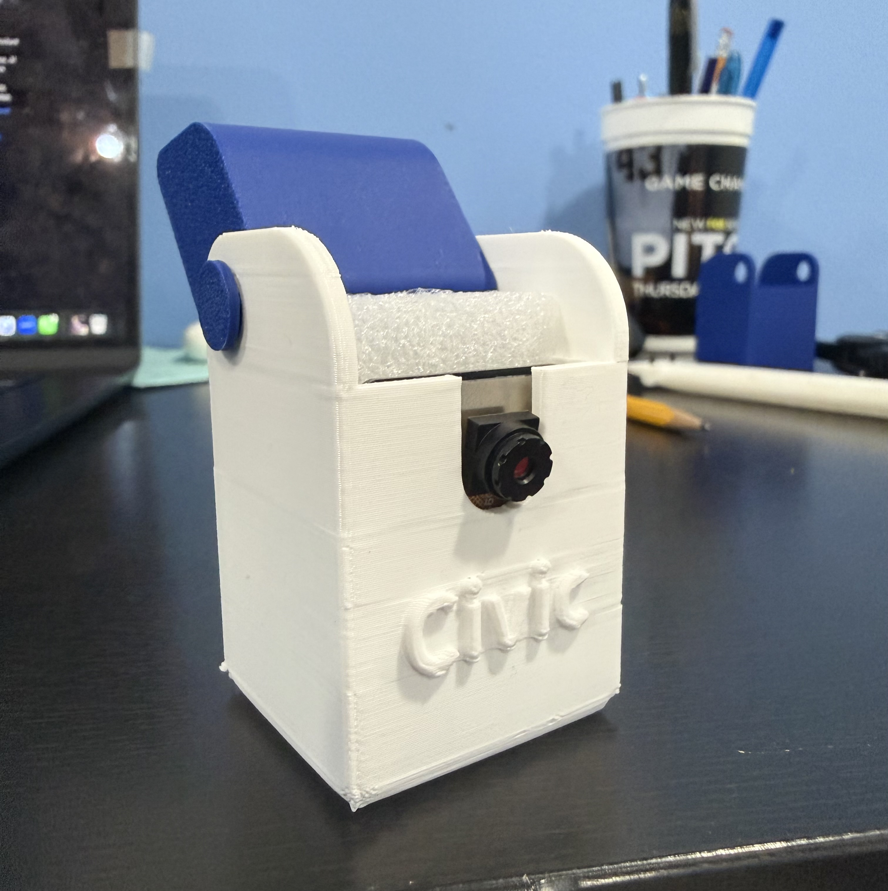
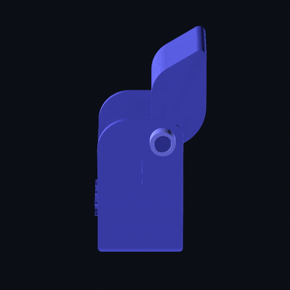
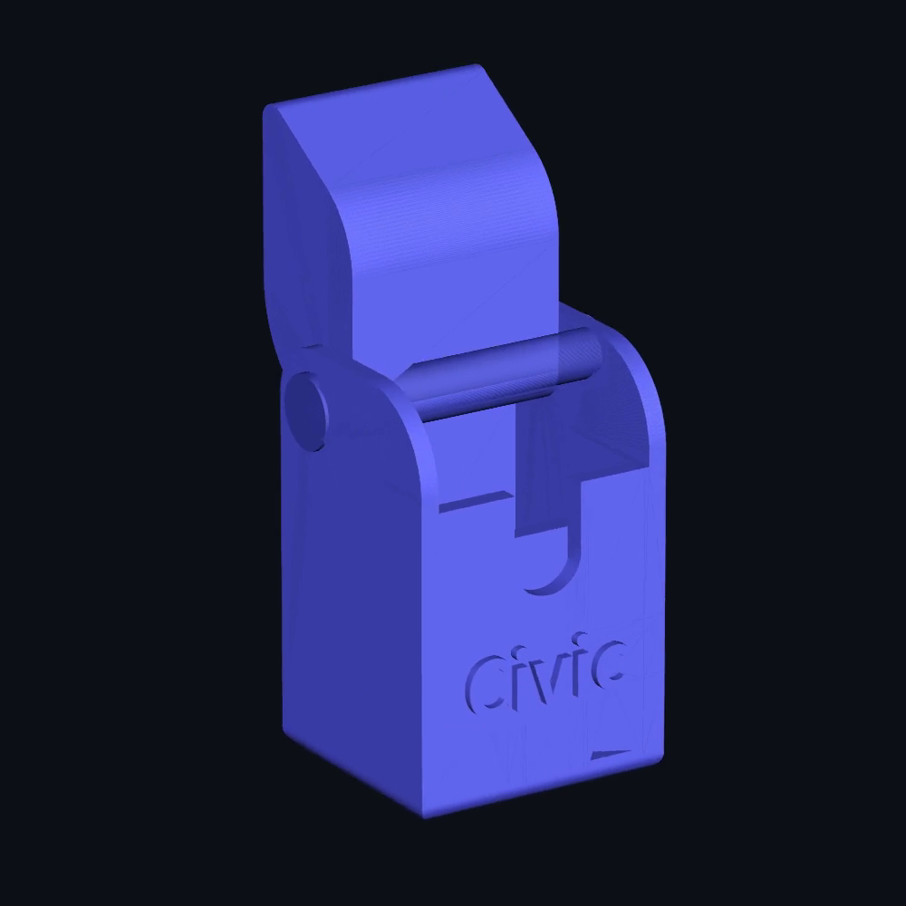

# Universal Camera

> A 3D-printed edge camera that rides on municipal fleet vehicles — the
> street-sweeper, the sanitation truck, the utility pickup, the inspection car,
> the ones already making regular rounds of the city — and turns every routine
> pass down a street into a road survey. It watches for obstructions
> (potholes, downed limbs, debris in the roadway, a damaged sign), and when it
> sees one it caches the location and a single frame on the device, then hands
> that frame to Civic's server-side Gemini classifier the moment it has signal.
> The resident intake channel sees only what someone bothers to report; this
> sees every street on every pass.

The print files are in [`print/`](print/). The physical unit is an ESP32 + an
ESP32-CAM in a printed shell, running off a battery, mounted on the dash.

## Why it exists

Resident photo intake (`/report`) is the front door, but it depends on a person
being present, noticing, and stopping to file. A blocked storm drain on an
industrial back street before a forecast storm is exactly the defect nobody
walks past — and a faded crosswalk marking is the kind of thing residents drive
over daily without ever thinking of it as reportable. Meanwhile the fleet
already covers those streets on a schedule: refuse collection touches every
residential block weekly, sweepers run arterials on a posted cycle, inspectors
drive between sites all day. Bolting a cheap camera to vehicles that are
already making the trip makes the routine drive itself the survey.

That is the whole cost argument. Coverage normally scales with staff — more
streets surveyed means more windshield hours, more headcount, or a contracted
survey run once every few years and stale a month later. This decouples the
two: the marginal cost of surveying one more street is the fuel already being
burned to drive it. No extra trip, no extra route, no extra person, and the
survey refreshes at whatever cadence the fleet already runs.

This is the physical form of a source the video pipeline already anticipates:
[`docs/planning/VIDEO_PIPELINE.md`](../../docs/planning/VIDEO_PIPELINE.md)
names "dashcams on city trucks" as a feed it was built to accept. The universal
camera is that feed, built.

## The one thing to understand: the edge model is a *trigger*, not the classifier

An ESP32-CAM is a 240 MHz microcontroller with a 2 MP sensor. It is not a
GPU. What actually fits on it is a tiny quantized detector — [Edge Impulse
**FOMO**](https://docs.edgeimpulse.com/hardware/boards/espressif-esp32)
(MobileNetV2 0.1) or an [ESP-DL](https://github.com/espressif/esp-dl) model —
running at **96×96–240×240** and **~700–860 ms per inference**. FOMO returns
object *centroids only*: no bounding box, no size, no fine class. That is
enough to answer one cheap question — **"is there something road-shaped worth a
closer look?"** — and nothing more. It cannot reliably tell a pothole from a tar
patch from a shadow, and the documentation must never pretend it can.

So the device is **Stage 1 of a two-stage pipeline**, and the split is the same
one Civic already runs for uploaded video:

1. **Stage 1 — on the device, LLM-free, effectively free.** FOMO scores each
   frame. Below a confidence gate, the frame is discarded and never leaves the
   camera. This is what makes the whole thing viable on a vehicle that spends
   its day in dead zones, parking structures, and cellular holes: hours of
   uneventful pavement cost zero bytes and zero API spend.
2. **Stage 2 — on the server, rare, one Gemini call.** A frame that clears the
   gate is cached with its GPS fix and capture time, and uploaded when the
   network returns. Server-side, it runs the **same Gemini classifier the video
   pipeline uses** — the authoritative call that assigns category, severity,
   hazard grade, and cost band. A confident hazard becomes a normal `reports`
   row and flows through classify → work order → SLA → crew-assign → Open311,
   all unchanged.

The edge model narrows; Gemini decides. Getting that boundary wrong is the one
way to make this product lie to a city about what its streets look like.

> **Hard rule, inherited from `agents.md` ("Never call Gemini from the
> client"): never call Gemini from the device.** The camera is a client. All
> model classification is server-side; the camera uploads a frame, it does not
> reason about it beyond the FOMO gate.

## Reference build (as built) and the recommended upgrade

The unit in `print/` is the **classic ESP32 + ESP32-CAM (AI-Thinker, OV2640)**.
It works, it is cheap, and its FOMO gate does the job of *"something is there."*
Its honest limits: one core is largely consumed by the camera driver, GPIO is
tight once the SD card is wired, and 240×240 is about the ceiling for a
responsive frame rate.

If detection quality matters more than parts cost, build it on an **ESP32-S3**
(e.g. the XIAO ESP32S3 Sense). The S3 has vector instructions and first-class
ESP-DL support, runs larger detectors (ESPDet-Pico, YOLOX-Nano) at higher
resolution, and frees enough GPIO that the GPS and SD card stop fighting the
camera for pins. **Recommendation: prototype on the AI-Thinker, deploy fleets on
the S3.** The shell in `print/` is dimensioned for the AI-Thinker module; an S3
build needs a resized camera aperture (see below).

## Bill of materials

| Part | Reference | Notes |
|---|---|---|
| MCU + camera | ESP32-CAM (AI-Thinker, OV2640) | reference build; ESP32-S3 (XIAO Sense) is the upgrade |
| USB programmer | FTDI / ESP32-CAM-MB | ESP32-CAM has no onboard USB — you need one to flash |
| GPS module | u-blox NEO-6M / NEO-M8N (UART) | **required** — the ESP32-CAM has no positioning of its own; this is the "geocache the location" part |
| Storage | microSD card | on-device buffer for gated frames + GPS log when offline |
| Battery | 1S 18650 Li-ion + protection, or vehicle 12 V → 5 V buck | dashcam duty cycles are short; size for the longest route between signal |
| Charge/regulation | TP4056 (18650) or a 12 V→5 V buck for vehicle power | ESP32-CAM peaks ~300 mA on Wi-Fi TX; do not under-spec the rail |
| Enclosure | printed shell, `print/` | PETG recommended (check print settings) |

<p align="center">
  
</p>

<sub>The assembled reference unit, printed from the current `shell-part-2.stl` — the `civic` emboss below the lens is the one carried in the STL. The lens sits behind the front cut-out; the arm on top is the windshield mount, pivoting on the side knob to level the camera on whatever vehicle it is fitted to.</sub>

## The ESP32-CAM itself — flashing, pins, power

Everything in this section is about the AI-Thinker reference board. The pin
numbers are read off Espressif's own sources — the `CAMERA_MODEL_AI_THINKER`
block in [`camera_pins.h`](https://github.com/espressif/arduino-esp32/blob/master/libraries/ESP32/examples/Camera/CameraWebServer/camera_pins.h)
in `arduino-esp32`, plus the ESP-IDF [SDMMC host](https://docs.espressif.com/projects/esp-idf/en/v5.2/esp32/api-reference/peripherals/sdmmc_host.html)
and [SD pull-up requirements](https://docs.espressif.com/projects/esp-idf/en/v5.2/esp32/api-reference/peripherals/sd_pullup_requirements.html)
pages — not from a forum post.

### Flashing: the board has no USB

The AI-Thinker module has no USB-serial bridge on it. There is no port to plug
into. Two ways to flash it:

- **An ESP32-CAM-MB baseboard.** The module drops onto it, it carries the
  USB-serial chip and the auto-reset circuit, and it handles the boot-mode pin
  for you. If you will flash more than twice, buy one.
- **A 3.3 V-logic USB-to-serial adapter (FTDI or CP210x) wired by hand:**

  | Adapter | ESP32-CAM | Note |
  |---|---|---|
  | TX | `U0RXD` (GPIO3) | crossed — the adapter's transmit goes to the board's receive |
  | RX | `U0TXD` (GPIO1) | crossed the other way |
  | GND | GND | a shared ground is not optional; a floating ground is its own class of failure |
  | 5V | `5V` pin | **feed 5 V, not 3V3** — see below |
  | — | `GPIO0` → `GND` | jumper to enter the bootloader; remove it afterwards |

**5 V, not 3V3.** The board has its own regulator behind the `5V` pin. Feeding
the `3V3` pin instead bypasses that regulator and puts the camera and the radio
straight onto the adapter's small on-board 3.3 V supply, which is not sized for
what this board draws while the Wi-Fi radio transmits. It is the most common
reason a correctly wired board still refuses to flash or boot.

**GPIO0 is a jumper, not a wire.** GPIO0 held low at reset puts the ESP32 into
download mode. It is also the camera's `XCLK` line. So the jumper goes on to
flash and comes off to run: leave it on and the board flashes fine and then
never produces a picture; fit it without pressing reset and the board never
enters the bootloader at all.

Failure symptoms and what they usually mean:

| Symptom | Usual cause |
|---|---|
| `Failed to connect to ESP32: Timed out waiting for packet header` | GPIO0 not grounded, no reset after grounding it, or TX/RX not crossed |
| Flashes, then the log repeats `Brownout detector was triggered` | the rail sags under the radio — powered from 3V3, thin wires, or a weak supply. The string is ESP-IDF's own; the reset reads back as `ESP_RST_BROWNOUT` |
| Boots, but the camera probe fails | GPIO0 jumper still fitted, or the ribbon connector is not seated |
| Boots and images, but PSRAM does not initialise | PSRAM disabled, or GPIO16 repurposed — see the pin budget |
| Garbage on the serial console | adapter set to 5 V logic instead of 3.3 V, or a baud mismatch |

### The pin budget is the real design constraint

The OV2640 is not on a serial bus. It hands over eight parallel data lines plus
clocks and syncs, and on this module that consumes most of the chip's usable
GPIO before you have wired anything of your own.

| Function | GPIO | Source |
|---|---|---|
| Camera data `Y2`–`Y9` | 5, 18, 19, 21, 36, 39, 34, 35 | `camera_pins.h` |
| Camera `XCLK` / `PCLK` / `VSYNC` / `HREF` | 0, 22, 25, 23 | `camera_pins.h` |
| Camera SCCB (`SIOD` / `SIOC`) | 26, 27 | `camera_pins.h` |
| Camera `PWDN` (there is no reset line — it is `-1`) | 32 | `camera_pins.h` |
| microSD in 4-bit mode: `CLK` `CMD` `D0` `D1` `D2` `D3` | 14, 15, 2, 4, 12, 13 | ESP-IDF SDMMC slot 1 |
| Flash LED (the bright white one) | 4 | `camera_pins.h` (`LED_GPIO_NUM`) |

Four of the camera's data pins —34, 35, 36, 39 — are **input-only** on the
ESP32, so they were never candidates for anything else. GPIO0 doing double duty
as `XCLK` and the boot strap is why the flashing jumper has to come off.

**Run the SD card in 1-bit mode.** Slot 1 supports either width. In 4-bit mode
the card also takes GPIO4, 12 and 13, and all three are a problem here:

- **GPIO4 is the flash LED.** SD `D1` traffic drives it, so a 4-bit card writes
  by strobing a bright white LED at the inside of the windshield. On a
  dash-mounted unit at night that is a driver-safety issue, not a cosmetic one.
- **GPIO12 is `MTDI`, the flash-voltage strapping pin.** Espressif is explicit:
  it has an internal pull-down and must read low at reset to select 3.3 V flash
  operation, while the SD protocol wants it pulled high. Their documented fix is
  burning the flash-voltage eFuse, which is irreversible. Do not do that to a
  prototype.
- **GPIO13** is then a third pin you cannot use for anything else.

1-bit mode costs card bandwidth this device does not need — it writes one gated
JPEG at a time, not video — and buys back three pins. Take the trade.

**What is left, and what the GPS gets.** After the camera and a 1-bit SD card,
the pins still in play:

| GPIO | State | Usable for the NEO-6M? |
|---|---|---|
| 1, 3 | `U0TXD` / `U0RXD`, the flashing and console UART | No. Hang the GPS here and you can neither flash nor read a log |
| 13 | free in 1-bit mode | **Yes — GPS TX → GPIO13.** This is the line that matters; the fix comes *from* the module |
| 12 | free in 1-bit mode, but is the `MTDI` strap | **Output only.** Fine for ESP → GPS configuration sentences; never put the GPS's own transmit line here — a module idling TX high at reset selects 1.8 V flash and the board will not boot |
| 4 | free in 1-bit mode, but is the flash LED | Avoid for signalling |
| 16 | wired to the PSRAM chip select on this module — that comes from community reproductions of the AI-Thinker schematic, not from an Espressif document, so treat it as the reason for caution rather than a verified fact | **No, in practice.** Free only with PSRAM disabled, and PSRAM is what makes a usable camera framebuffer possible |

The ESP32's UART peripherals route through the GPIO matrix, so UART1 or UART2
can be pointed at 13 and 12; there is no fixed "default" pinout to work around.
The NEO-6M is one-way in normal operation — it emits NMEA and needs nothing back
— so a receive line on GPIO13 and nothing else is a complete GPS wiring for this
build.

That is the entire budget: one UART's worth of pins and no room for a second
peripheral. It is also the concrete reason behind the recommendation above to
prototype here and deploy on an S3.

### Power

The BOM notes the ~300 mA peak on Wi-Fi TX. The word doing the work is *peak*:
the board sits well below that and then pulls the spike during a transmit burst,
which on this device is exactly the moment it is trying to push a batch of
cached frames at the depot. Size the supply for the spike, not the mean.

When the rail cannot hold, the ESP32's brownout detector resets the chip. The
signature is a console repeating `Brownout detector was triggered` and rebooting
in a loop, with the reset reason reading back as `ESP_RST_BROWNOUT`. It is a
power-supply fault that looks exactly like a firmware crash, which is why it
costs people so much time. Usual causes, in order: the board fed from an
adapter's 3V3 pin instead of `5V`; long or thin jumper wires between supply and
board; a battery near the end of its discharge, where every transmit
brownout-resets the chip and the reset burns more charge.

For a vehicle build that sets the requirements on the 12 V → 5 V buck:

- **Headroom over the peak, not the average.** A converter specified at the mean
  draw will dip on every transmit burst.
- **Automotive input range.** A vehicle rail sits nearer 14 V with the
  alternator charging and collapses during cranking. The converter has to
  survive both ends and the transients between.
- **Bulk capacitance close to the board**, so the transmit spike comes out of a
  local capacitor rather than out of the converter's response time.
- **Short, thick leads to the `5V` pin.** Resistance in the supply wiring is the
  same failure as an undersized converter.

On battery rather than the vehicle rail, the same detector is what ends a route:
the unit does not fade gracefully, it starts brownout-looping. Size the pack for
the longest stretch between charging points, and read the first brownout reset
in a log as the end of usable runtime rather than as a glitch.

### What the ESP32-S3 changes

The recommendation above stands — prototype on the AI-Thinker, deploy fleets on
the S3. Concretely, what moves:

- **Vector instructions.** The S3 is a dual-core Xtensa LX7 with a 128-bit
  vector extension aimed at neural-network and DSP work. That is the hardware
  reason a larger detector can run at a usable cadence rather than at the
  ~700–860 ms this gate needs.
- **First-class ESP-DL support**, and with it detectors that return boxes rather
  than FOMO's centroids. Note what this does *not* change: the device still
  gates, the server still classifies. A better edge model buys a lower false
  gate rate and less uploaded bandwidth, nothing else.
- **More input resolution inside the same frame budget**, which is the part that
  matters for a defect occupying a small share of the frame.
- **Freed GPIO.** The S3 carries 45 programmable GPIOs, so the GPS UART and the
  SD card stop competing with the camera for the handful of pins the table above
  spends a whole section enumerating.
- **Native USB.** The S3 has a built-in USB Serial/JTAG controller and, per
  Espressif, does not require an external USB-UART bridge chip. No FTDI, no
  GPIO0 jumper, no boot-mode ritual — which matters more than it sounds when the
  alternative is performing that ritual once per unit across a fleet.

The shell in `print/` is dimensioned for the AI-Thinker module, so an S3 build
needs its aperture re-modelled before anything is printed at quantity.

## Enclosure — printing the shell

Four STL parts in [`print/`](print/), exported from the CAD "Part Studio."
Measured bounding boxes, with roles read off the assembled unit (see the photo
above): a box body that holds the ESP32-CAM with the lens through the front, a
mount connector that pivots off the top, and the two small cylinders that form
the pivot.

| File | Footprint (mm) | Triangles | Role |
|---|---|---|---|
| `shell-part-2.stl` | 37 × 57 × 36 | 5 886 | main body — houses the ESP32-CAM, lens aperture on the front, `civic` embossed below it |
| `shell-part-5.stl` | 31 × 41 × 22 | 1 172 | mount connector — clamps to a vehicle windshield; the curved arm pivots to set the camera angle |
| `shell-part-3.stl` | 43 × 10 × 10 | 1 152 | hinge axle — the pin the mount pivots on |
| `shell-part-4.stl` | 5 × 10 × 10 | 1 152 | pivot knob — the round knob on the side that sets and holds the angle |



<sub>Turntable of the assembled shell, rendered straight from the four STLs in `print/` by [`media/render-turntable.py`](media/render-turntable.py) — geometry, not a mock-up. Higher-resolution version: [`media/shell-turntable.mp4`](media/shell-turntable.mp4) (GitHub does not play an mp4 inline; the link downloads it).</sub>

**The geometry against the object.** Left is a still frame lifted out of that
turntable at 3.3 s — triangles from `print/`, nothing else. Right is the same
view of the printed unit.

<table>
<tr>
<td width="50%" valign="top"></td>
<td width="50%" valign="top"></td>
</tr>
<tr>
<td valign="top"><b>The STL.</b> Straight geometry: the emboss, the aperture cut-out, the hinge axle across the top and the knob on the side are all features of the model, not of the photograph.</td>
<td valign="top"><b>The print.</b> The same parts off a printer, with the ESP32-CAM seated behind the aperture and foam holding the module against the shell. Layer lines round the emboss off and the arm is printed separately in a second colour — nothing else moved between the model and the part.</td>
</tr>
</table>

**Why the mount pivots.** A municipal fleet is not one vehicle — a pickup dash,
a refuse truck cab, a bus windshield and a sedan all present the glass at a
different rake — so the mount clamps to the windshield and the arm pivots on
the side knob to level the lens on whatever it is fitted to. One printed part
fits the whole fleet without a per-vehicle variant.

**Suggested print settings** (a dash-mounted part that bakes in a hot car):

- **Material: PETG.** PLA sags on a summer dashboard and is the wrong choice for
  anything living behind a windshield. ASA is better still if you have it.
- 0.2 mm layers, 3 perimeters, 20–30% infill.
- Supports only where the camera aperture and connector cut-outs overhang.
- Orient the body so the lens face is not the bed face — you want the cleanest
  surface over the aperture, not against the build plate.

If you build on an ESP32-S3, the camera module footprint differs; scale or
re-model the aperture in `shell-part-2` before printing a fleet.

## How a detection becomes a report

Civic already has the server half of this device. Migration
[`20260823_064_camera.sql`](../../supabase/migrations/20260823_064_camera.sql)
ships `camera_devices`, `detections` and `detection_clusters`; the ingest route
is [`src/app/api/camera/frames/route.ts`](../../src/app/api/camera/frames/route.ts)
and the pipeline behind it is [`src/lib/camera/ingest.ts`](../../src/lib/camera/ingest.ts).
The camera does not need a new backend. It needs to enrol as a `camera_devices`
row with `kind = 'vehicle'` and POST batches.

```
[fleet vehicle drives its route]
        │
        ▼
  ESP32-CAM frame ──► FOMO gate (on device, ~0.7–0.9 s)
        │                     │ below gate: discard, nothing leaves the device
        │ clears gate
        ▼
  cache on SD: { jpeg frame, GPS lat/lng, capture timestamp, frame id }
        │
        │ (offline: sits on the card. capture time is recorded now, not at upload.)
        ▼
  depot wifi ──► POST /api/camera/frames   (x-api-key, scope camera:ingest,
        │                                    ≤ 200 frames per batch)
        ▼
  server detector sidecar scores each frame
        │            │ score < 0.5: frame DROPPED ENTIRELY — never stored
        │ clears
        ▼
  blurServerSide() on the crop ──► blur fails: detection dropped, not stored raw
        │
        ▼
  blurred crop → photos-public;  `detections` row (crop_url NOT NULL)
        │        raw frame is never persisted, anywhere
        ▼
  cluster: same damage_class within 8 m of an unresolved cluster
        │
        │  < 3 passes, or all on one day: keep observing. No report, no LLM call.
        ▼
  promote: >= 3 passes across >= 2 distinct days
        │
        ▼
  ONE classify run — runClassifyPipeline(reportId), the same classifier a
  resident photo goes through
        ▼
  classify → work order → SLA stamp → crew-assign → Open311  (all unchanged)
```

**Why clustering is the load-bearing part.** A refuse truck passes the same
pothole roughly twenty times a day. Without clustering that is thousands of
reports and thousands of model calls for one defect. `detection_clusters`
collapses repeat sightings by class and location, and only a cluster that has
been seen on at least two separate days becomes a report — which also means a
one-off shadow never does. The thresholds are in
[`src/lib/liability/config.ts`](../../src/lib/liability/config.ts):
`CLUSTER_RADIUS_M = 8`, `PROMOTE_MIN_PASSES = 3`, `PROMOTE_MIN_DISTINCT_DAYS = 2`.

**Two gates, not one.** The FOMO model on the device is the first gate and it
only saves bandwidth; the server-side detector at `DETECTOR_MIN_SCORE = 0.5` is
the gate that decides what gets stored; the classify run on promotion is the
only thing that assigns a category, severity or cost. The device is the cheapest
filter in that chain, not a participant in the decision.

**The video pipeline is a different door.** Migration
[`20260824_056_video_pipeline.sql`](../../supabase/migrations/20260824_056_video_pipeline.sql)
handles *uploaded clips* — `video_feeds` with `kind IN ('upload', 'rtsp', 'phone')`,
`damage_detections`, `video_detection_clusters`, ffmpeg frame extraction on the
host. That path exists and works, but it is for footage a person hands the
system after the fact. A fleet unit that batches gated frames belongs on
`/api/camera/frames`. Do not wire it into `video_feeds`: the CHECK constraint has
no edge kind, and the privacy handling differs (see below).

## Firmware: what it has to do

**There is no firmware in this repository.** The print files are here, the
server half is here, the wiring is written down above — the sketch that runs on
the device is not, and nothing below has been compiled or driven on a vehicle.
What follows is the specification a builder implements against, written out so
that the device half and the already-shipped server half cannot drift apart. The
request contract is not invented here: it is
[`src/app/api/camera/frames/route.ts`](../../src/app/api/camera/frames/route.ts)
as it stands.

**Boot.** Bring up the camera driver, the SD card (1-bit mode — see the pin
budget), and the GPS UART, in that order, and fail loudly on each. A unit that
boots without a card silently discards everything it gates; a unit that boots
without GPS cannot produce a frame the ingest route will accept, because
`detections.location` is `NOT NULL`.

**The loop.**

1. **Capture** a frame at the gate's cadence — one inference every ~0.7–0.9 s on
   this hardware, which is the ceiling, not a target to tune down from.
2. **Gate** it with the on-device model. Below the confidence threshold, discard
   the frame and free the buffer. This is the common path by a wide margin, and
   it must cost nothing: no card write, no log line, no allocation that survives
   the iteration.
3. **Cache** anything that clears the gate to the SD card as a record of
   `{ jpeg, lat, lng, captured_at, frame_id }`. Three properties are
   load-bearing:
   - `captured_at` is stamped **now**, at capture, never at upload. The
     promotion rule counts distinct capture days; stamping at upload collapses a
     week of cached frames into one day and silently defeats it.
   - `frame_id` is device-local, stable, and never reused. It is the idempotency
     key the server deduplicates on, which is what makes retrying a batch free.
   - No fix, no cache. Hold gated frames until the first GPS fix and stamp them
     then, or drop them. Do not invent a coordinate.
4. **Upload** when the network returns. `POST /api/camera/frames`, body
   `{ deviceId, frames: [...] }`, at most **200 frames per batch** — the route
   rejects more. Per frame: `externalId` (the device-local `frame_id`),
   `capturedAt` as an ISO 8601 timestamp **with an offset**, `lat`, `lng`,
   `imageBase64OrUrl`, and optionally `headingDeg` and `speedMps` if the GPS
   gives them. The API key goes in the **`x-api-key` header** — the route also
   reads an `api_key` query parameter, and the device must not use it, because a
   credential in a query string ends up in logs, proxies and referrers.
5. **Delete on 2xx, and only on 2xx.** A batch the server accepted is a batch
   whose frames can leave the card. Anything else keeps them.
6. **Retry on 503.** The route answers infrastructure failures with
   `{ retryable: true }` on the assumption the uploader re-sends **the same
   bytes with the same `externalId`s**. Re-send unchanged; do not regenerate ids
   on retry, or the idempotency key stops matching and one defect's passes get
   counted twice. Back off between attempts — the route also rate-limits per
   caller, so a tight retry loop turns a recoverable 503 into a 429.
7. **Do not retry a 4xx.** `401`/`403` is a key, scope, city-pinning or
   device-active problem; `400` is a malformed batch; `404` is a device that was
   never enrolled. All four are configuration faults a device cannot fix by
   trying again, and all four need to surface at the depot rather than spin.

**What the firmware must never do.** Call a model API. Classify a defect.
Assign a category, a severity or a crew. Skip the gate and stream everything.
Write a frame to the card without a fix. Each one is an invariant below, not a
style preference.

## Invariants (do not weaken)

Each one is an existing rule of this codebase that the camera must not become
the exception to.

- **Raw frames are never persisted.** This is stricter than "keep them private."
  `ingest.ts` drops below-threshold frames before any write, blurs every
  surviving crop with `blurServerSide()`, and stores only the blurred crop — a
  crop whose blur fails is dropped rather than stored unblurred.
  `detections.crop_url` is `NOT NULL` precisely so there is no crop-less row to
  attach a raw frame to later. An ESP32-CAM cannot blur faces or plates
  on-device, which is exactly why the blur has to be the server's job and the
  device must never be given a path that skips it.
  *(Note the asymmetry with the video pipeline, which keeps unblurred frames in
  the private `video-frames` bucket and shows
  `public/video-detection-placeholder.svg` publicly. Both satisfy the privacy
  rule by different means. Camera ingest uses the blur-and-publish route; do not
  mix the two models in one path.)*
- **Capture time, not delivery time.** `detections.captured_at` is when the
  vehicle passed the defect, not when the truck got back into coverage. It rides
  through as the report's capture time so the SLA clock, the street's history,
  and any before/after comparison reflect when the road was actually in that
  condition. Promotion also counts *distinct capture days* — let the upload
  moment overwrite the timestamp and a week of cached frames collapses into one
  day, which silently defeats the promotion rule.
- **The camera is a machine identity, not a resident.** It presents an `api_keys`
  row scoped `camera:ingest`, never a resident session cookie. There is
  deliberately **no RLS insert policy** on `detections` or `detection_clusters` —
  ingest writes with the service role behind the route, so a leaked anon key
  cannot forge detections at arbitrary coordinates and, through promotion, forge
  reports. A city-pinned key may only push for devices in its own city. Send the
  key in the `x-api-key` header: a credential in a query string ends up in logs,
  proxies and referrers.
- **Idempotency is what makes retry safe.** A batch is keyed on
  `(device_id, frame_external_id)`, so re-posting an identical batch over flaky
  depot wifi is a no-op rather than a double-counted cluster. The route answers
  infrastructure failures with `503 retryable: true` on the assumption the
  uploader re-sends the same bytes. Break idempotency and that posture turns into
  inflated pass counts and premature promotions.
- **The edge model does not classify.** It gates. Any change that lets the device
  decide a defect's category, severity, or dispatch on its own — instead of
  deferring to the server — breaks the contract and is wrong.

## Honest limits

- **False positives are the edge model's native failure.** A 96×96 FOMO gate on
  a bouncing dashboard will fire on shadows, wet patches, and manhole covers.
  That is *tolerable by design*: the server detector drops it below 0.5, and
  anything that survives still has to be seen three times across two days before
  it costs a single model call. A false gate costs bandwidth, not a false report.
  It is only a problem if someone removes the promotion rule.
- **Motion blur and frame rate.** A 0.7 s inference cadence skips a lot of road,
  and a 2 MP rolling-shutter sensor smears at speed. Municipal fleet work is the
  saving grace: sweepers, refuse trucks and inspection vehicles spend their
  routes at residential and arterial speeds, with frequent stops, which is
  roughly the envelope this sensor can hold. Do not assume it generalises to
  highway speed — a unit on a car at 70 mph is a different and unvalidated
  problem.
- **GPS cold start.** A NEO-6M can take a minute-plus to first fix, and
  `detections.location` is `NOT NULL` — the ingest route has nowhere to put a
  fixless frame. Hold gated frames on the card until the first fix and stamp them
  then, or drop them; do not invent a coordinate. This is a real gap between the
  device and the schema, and the honest answer today is that pre-fix frames are
  lost.
- **Promotion means the first sighting is never a report.** Three passes across
  two days is what stops one pothole from generating thousands of reports, and
  the price is latency: a defect that appears on a Friday afternoon route is not
  a report until a vehicle has passed it again on another day. A hazard that
  needs same-day dispatch still depends on a resident filing it. The camera adds
  coverage, not speed.
- **Power and heat.** A camera behind a windshield in a parked vehicle in
  midsummer is a thermal problem before it is a battery problem. PETG/ASA and
  ventilation in the shell are load-bearing, not cosmetic.

## Related

- The server this device talks to: [`src/app/api/camera/frames/route.ts`](../../src/app/api/camera/frames/route.ts), [`src/lib/camera/ingest.ts`](../../src/lib/camera/ingest.ts), [`src/lib/camera/cluster.ts`](../../src/lib/camera/cluster.ts)
- The schema it enrols into: [`supabase/migrations/20260823_064_camera.sql`](../../supabase/migrations/20260823_064_camera.sql)
- Design intent for the whole camera vertical: [`docs/planning/CAMERA_LIABILITY_PIPELINE.md`](../../docs/planning/CAMERA_LIABILITY_PIPELINE.md)
- The separate uploaded-clip path: [`docs/runbooks/video-pipeline.md`](../../docs/runbooks/video-pipeline.md), [`docs/planning/VIDEO_PIPELINE.md`](../../docs/planning/VIDEO_PIPELINE.md)

There is no runbook or ADR for the camera hardware yet. An operational procedure
(enrolling a unit, key rotation, failure modes) would belong in `docs/runbooks/`,
and the "edge-as-first-gate rather than a parallel ingest path" decision would be
the next ADR in `docs/decisions/` — neither is written, so neither is linked.
